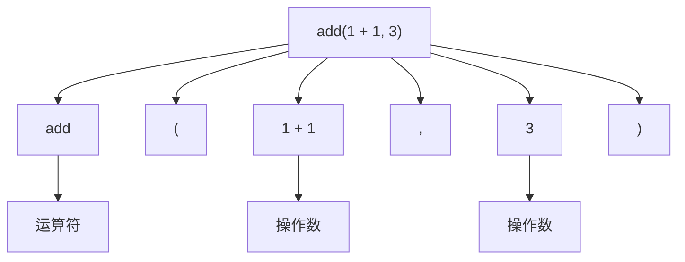
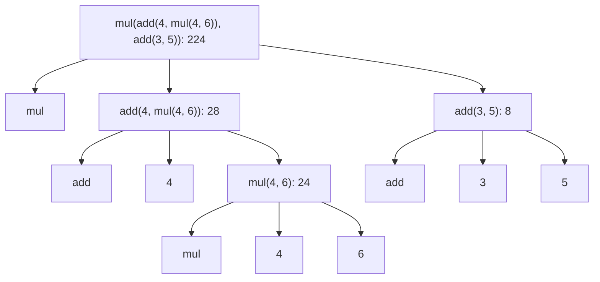

# 欢迎

欢迎参加 CS61A 课程！

## 关于课程

### 这门课程是讲什么的？

- 一门关于管理复杂性的课程
  - 掌握抽象
  - 隔离和解决问题
  - 学会组织复杂的程序

- 编程入门 
  - 全面理解 Python 基础
  - 通过大型项目展示如何管理软件复杂性
  - 计算机如何解释编程语言
- 不同类型的语言
  - Python、Scheme 和 SQL

## 如何成功

### 讲座、视频和教科书

- 视频：讲座前必看，所有课程内容都会在视频中涵盖。
- 教材：得简洁有用，内容与视频非常相似。
- 讲座：回顾视频中最重要的内容，通过示例讨论问题的解决策略。

### 2024 年秋季学生的建议

- “讲座前观看视频。”
- “观看视频。绝对有助于提前理解讲座内容，这也是为什么我在学期后半段感到迷茫的原因。”
- “显然要观看视频，尽量不要以 2 倍速观看（我就是这样做的，很后悔）…… 如果不花时间处理信息，第二天早上就会忘记。”
- “跟上讲座进度，观看视频，尽量真正理解每一步，以免最后堆积如山。”
- “确保在讲座前观看讲座视频，这样讲座时间可以用来提问和进一步理解。”

## 练习解决问题

通过**练习**，解决问题会变得更容易。

- 必须参加实验和讨论
- 作业和项目

## 讨论

讨论部分该做什么？

- 得到一份充满示例问题的工作表，大家一起解决这些问题并遵循一些指示。
- 重点不仅是解决这些问题，而是学习如何解决类似问题。
- 不必解决所有的问题。

## 合作

### 强烈鼓励一起工作

- 互相讨论一切；向同学学习！
- 一些项目可以与合作伙伴一起完成。

### 什么是学术不端行为？

- 请不要看别人的代码！
  - 以下情况除外：实验、你的项目合作伙伴，或者在你已经解决问题之后。
- 请不要告诉别人答案！
  - 你可以指出错误并描述如何修复，或展示一个相关示例。
- 请不要使用 ChatGPT 或类似工具为你编写代码。
- 复制项目解决方案会导致课程不及格。

### 现在养成好习惯

### 2024年秋季学生的建议

- “LLM 是有用的工具，你可能会偶尔作为软件工程师或计算机科学家使用，但你应该能够在不依赖 ChatGPT 的情况下独立解决问题，因为不需要依赖 ChatGPT 但可以使用它来增强工作流程的人将比依赖 ChatGPT 的人更有生产力和能力。”
- “在某些时候，当你遇到错误时，很容易直接问 ChatGPT。为了你自己，我强烈建议不要这样做…… 你在 CS61A 中解决简单问题所获得的技能将对你以后解决更棘手问题至关重要，完全依赖 ChatGPT 只能带你走这么远。如果你因为赶截止日期而使用 ChatGPT，我强烈建议你稍后再回来彻底理解这个问题。”

## 表达式

### 表达式的类型

表达式描述一次计算并求一个值。

$18+69$，$\dfrac{6}{23}$，$\sin\pi$

$\log_2{1024}$，$2^{100}$，$7\mod{2}$

$f(x)$，$\sqrt{3493161}$，$\lim_{x\to{0}}\dfrac{1}{x}$

$\mid{-1869}\mid$，$\sum_{i=1}^{100}i$，$\begin{pmatrix} 69 \\ 18 \end{pmatrix}$

## Python 中的调用表达式

所有表达式都可以使用函数调用。

## 调用表达式

### 调用表达式的解析

- 运算符和操作数也是表达式。
- 表达式可以求值。

### 调用表达式的求值过程

1. 先算运算符，然后算操作数的子表达式。
2. 将函数中运算符的值应用到参数中操作数的值上。

## 评估嵌套表达式

表达式树

